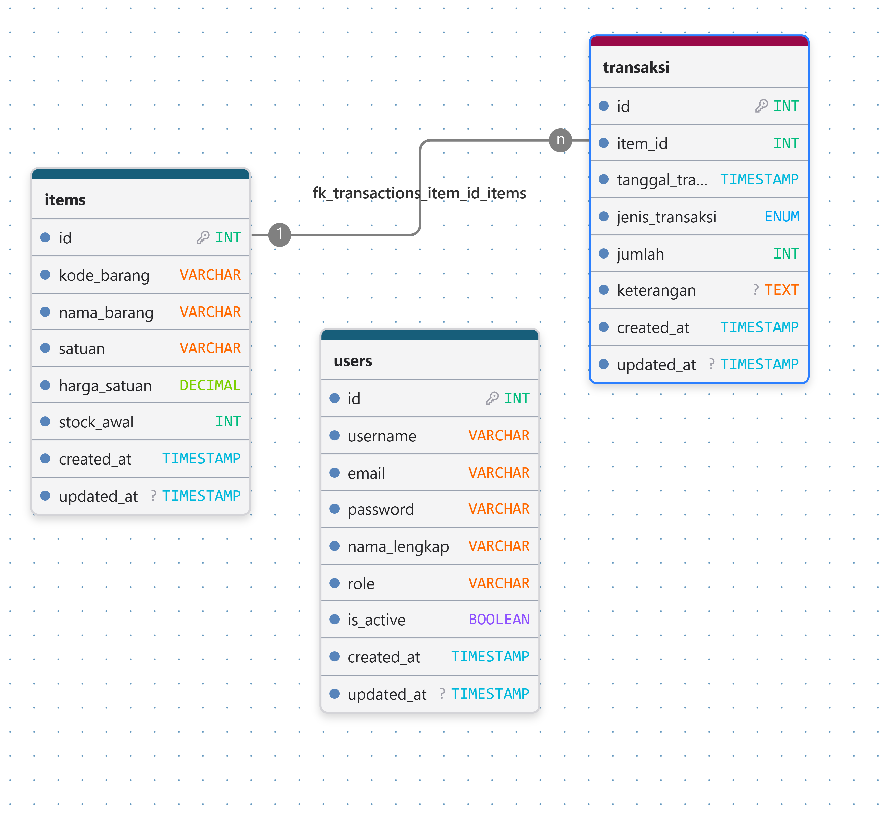

# Technical Tes MagangHub 2026


## Installation

### Login untuk masuk website nya

```bash
Email : admin@gmail.com
Password : admin123
```

### 1. Clone Repository

```bash
git clone https://github.com/Aanadi354/tes_maganghub_2026.git
cd tes_maganghub_2026
```

---

## Backend Setup (Laravel)

### 2. Masuk ke folder backend

```bash
cd backend
```

### 3. Install dependency Laravel

```bash
composer install
```

### 4. Salin file environment

**Windows (Command Prompt)**

```cmd
copy .env.example .env
```

**Windows (PowerShell) / Linux / macOS**

```bash
cp .env.example .env
```

### 5. Generate application key

```bash
php artisan key:generate
```

### 6. Konfigurasi database

Buka file `.env`, kemudian ubah konfigurasi database sesuai database lokal Anda.

Contoh:

```env
DB_CONNECTION=mysql
DB_HOST=127.0.0.1
DB_PORT=3306
DB_DATABASE=tes_maganghub
DB_USERNAME=root
DB_PASSWORD=
```

Pastikan database **tes_maganghub** sudah dibuat terlebih dahulu di MySQL.

### 7. Jalankan migration dan seeder

```bash
php artisan migrate --seed
```

Seeder akan membuat akun administrator secara otomatis.

### 8. Jalankan Laravel Server

```bash
php artisan serve
```

Backend akan berjalan pada:

```
http://127.0.0.1:8000
```

---

## Frontend Setup (Vue.js)

### 9. Buka terminal baru kemudian masuk ke folder frontend

```bash
cd frontend
```

### 10. Install dependency

```bash
npm install
```

### 11. Jalankan Vue Development Server

```bash
npm run dev
```

Frontend akan berjalan pada:

```
http://localhost:5173
```

---

## Login

Gunakan akun administrator yang dibuat oleh seeder.

**Email**

```
admin@gmail.com
```

**Password**

```
admin123
```

> Apabila Anda mengubah data pada `AdminSeeder.php`, sesuaikan email dan password di atas.

---

## Project Structure

```
Technical Test
├── backend
│   ├── app
│   ├── routes
│   ├── database
│   └── ...
│
└── frontend
    ├── src
    ├── components
    ├── services
    └── ...
```

---

## Notes

- Pastikan PHP, Composer, Node.js, npm, dan MySQL telah terinstall.
- Jalankan backend dan frontend pada terminal yang berbeda.
- Jangan menghapus file `.env.example`.
- File `.env`, `vendor`, `node_modules`, dan `dist` tidak disertakan pada repository karena dibuat secara otomatis saat proses instalasi.


## Features Yang Tersedia

- **Autentikasi Login:** Mengamankan akses aplikasi sehingga hanya pengguna yang memiliki akun yang dapat masuk.
- **Manajemen Data Barang:** Menambah, mengubah, menghapus, dan melihat data barang beserta informasi stok.
- **Transaksi Barang Masuk & Keluar:** Mencatat setiap transaksi sehingga stok barang diperbarui secara otomatis.
- **Riwayat Transaksi:** Menampilkan seluruh aktivitas barang masuk dan keluar sebagai dokumentasi serta memudahkan proses pelacakan.


## Tech Stack

- **Frontend:** Vue.Js, Vue Router
- **Backend:** Laravel 13, Laravel Sanctum
- **Database:** MySQL
- **HTTP Client:** Axios
- **Tools:** Node.js, npm, Git, GitHub
- **PDF Export:** jsPDF, jsPDF AutoTable

**Struktur Database**\



## 📫 Contact

Aan Adi Setiyawan - Universitas Trunodjoyo Madura

Linkedin : <https://www.linkedin.com/in/aan-adi-setiyawan-094111242/>

Instagram : <https://www.instagram.com/aaan.adi/>
